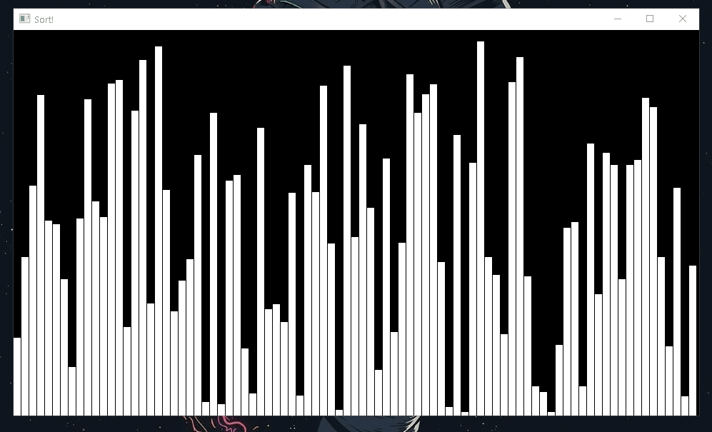

# Sorting Visualizer 
This is a sorting visualizer made in c++ using sfml.

## How To Use It
- Press **1** for bubble sort
- Press **2** for insertion sort 
- Press **3** for selection sort 
- Press **4** for quick sort
- Press **0** to randomize the rectangles

##Demo

